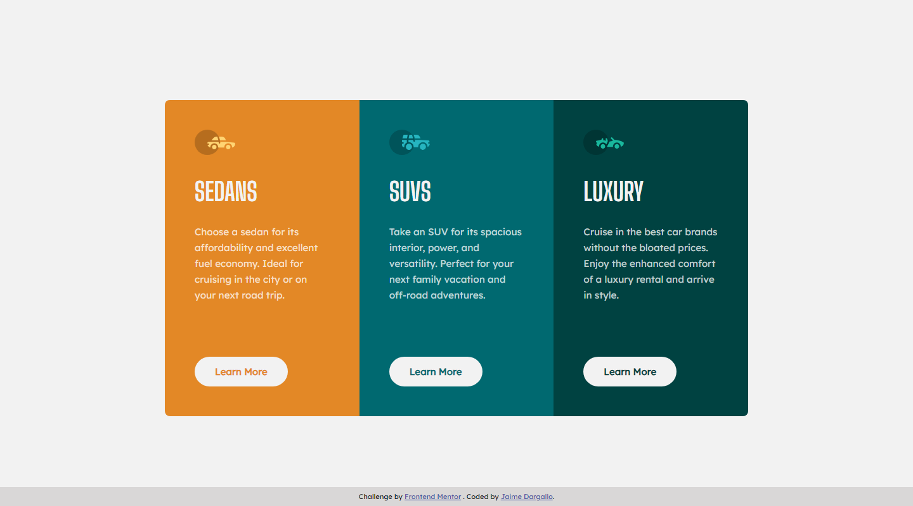

# Frontend Mentor - 3-column preview card component solution

This is my solution to the [3-column preview card component challenge on Frontend Mentor](https://www.frontendmentor.io/challenges/3column-preview-card-component-pH92eAR2-). Frontend Mentor challenges help you improve your coding skills by building realistic projects.

## Table of contents

- [Overview](#overview)
  - [The challenge](#the-challenge)
  - [Screenshot](#screenshot)
  - [Links](#links)
- [My process](#my-process)
  - [Built with](#built-with)
  - [What I learned](#what-i-learned)
  - [Continued development](#continued-development)
  - [Useful resources](#useful-resources)
- [Author](#author)
- [Acknowledgments](#acknowledgments)

## Overview

### The challenge

Users should be able to:

- View the optimal layout depending on their device's screen size
- See hover states for interactive elements

### Screenshot



### Links

- Solution URL: [@jaimedargallo/frontendmentor-3-col](https://github.com/jaimedargallo/frontendmentor-3-col)
- Live Site URL: [frontendmentor-3-col](https://frontendmentor-3-col.vercel.app/)

## My process

### Built with

- Semantic HTML5 markup
- Flexbox
- Mobile-first workflow

### What I learned

In this proyect I learn about:

Using semantic HTML5 markup would have taught the importance of creating structured and meaningful content that search engines and screen readers can easily interpret.

```html
<body>
  <main>
    <article></article>
    [...]
  </main>
  <footer></footer>
</body>
```

How to create flexible layouts that can adapt to different screen sizes and devices. I would have also learned how to control the alignment and distribution of content within the layout.

Adopting a mobile-first workflow would have taught I how to prioritize mobile devices when designing your project. This approach would have helped I create a responsive design that looks great on both small and large screens.

The importance of using media queries to adjust the layout based on the device's screen size.

I added hover states for interactive elements too.

```css
.btn {
	transition-property: color, background-color, border-color;
	transition-duration: 300ms;
	transition-timing-function: ease-in-out;
}

.btn:hover {
    background-color: transparent;
    border: 1px solid;
    color: hsl(0, 0%, 95%);
}
```

### Useful resources

- [Freecodecamp](https://www.freecodecamp.org/) - The place where I learn the basics about HTML and CSS.
- [Flexbox Froggy](https://flexboxfroggy.com/) - A game to practice flexbox with CSS.

## Author

- Frontend Mentor - [@jaimedargallo](https://www.frontendmentor.io/profile/jaimedargallo)
- Twitter - [@jaimedargallo](https://twitter.com/jaimedargallo)
- Github - [@jaimedargallo](https://github.com/jaimedargallo)

## Acknowledgments

I would like to take this opportunity to express my heartfelt gratitude and appreciation to my personal mentor [@boton](https://github.com/boton). I feel incredibly fortunate to have had the privilege of working closely with such an inspiring and supportive mentor.
